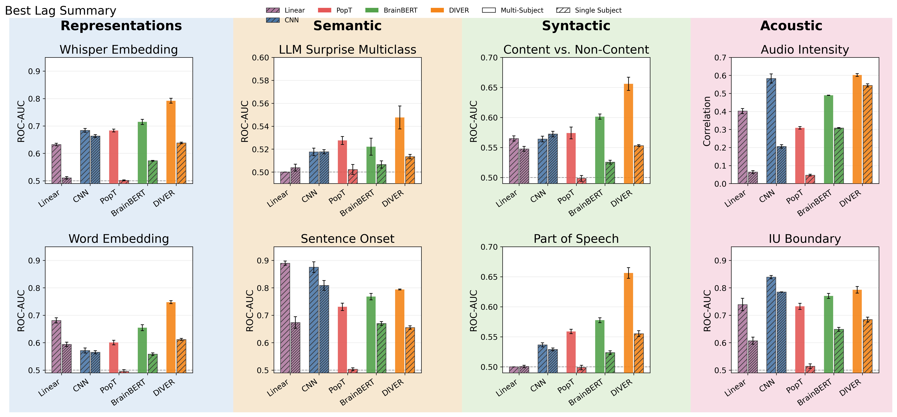

# Baseline and Cross-Model Results

This page summarizes the current paper result set. The plots are generated in
`paper-results/`, and the exact lag-level metrics are stored in
`benchmark-results/`.

The comparison includes five model families:

- **Linear**: linear baseline
- **CNN**: neural convolution decoder baseline
- **PopT**: foundation model
- **BrainBERT**: foundation model
- **DIVER**: foundation model

The summary below reports the best lag for each model, task, and evaluation
condition. Values in parentheses show the best lag and, when present, the
relative difference from the best model in that row.

The paper summary currently covers eight tasks. Scalar LLM surprise regression,
LLM token decoding, and LLM embedding pretraining remain in
`benchmark-results/`, but they are not included in this cross-model figure set.

Metrics by task:

- `content_noncontent`, `gpt_surprise_multiclass`, `iu_boundary`, `pos`,
  and `sentence_onset`: ROC-AUC
- `word_embedding`: average word-level ROC-AUC
- `whisper_embedding`: pairwise accuracy
- `volume_level`: correlation

## Cross-Model Summary

| condition | task | Linear | CNN | PopT | BrainBERT | DIVER |
| --- | --- | --- | --- | --- | --- | --- |
| per_subject | content_noncontent | 0.548 (0 ms; -4%) | **0.572 (0 ms)** | 0.499 (0 ms; -13%) | 0.526 (0 ms; -8%) | 0.553 (0 ms; -3%) |
| per_subject | gpt_surprise_multiclass | 0.504 (0 ms; -3%) | **0.518 (0 ms)** | 0.502 (0 ms; -3%) | 0.507 (0 ms; -2%) | 0.514 (0 ms; -1%) |
| per_subject | iu_boundary | 0.607 (0 ms; -23%) | **0.785 (0 ms)** | 0.514 (0 ms; -34%) | 0.649 (0 ms; -17%) | 0.684 (0 ms; -13%) |
| per_subject | pos | 0.501 (0 ms; -10%) | 0.529 (0 ms; -5%) | 0.499 (0 ms; -10%) | 0.524 (0 ms; -6%) | **0.555 (0 ms)** |
| per_subject | sentence_onset | 0.674 (0 ms; -17%) | **0.809 (0 ms)** | 0.503 (0 ms; -38%) | 0.670 (0 ms; -17%) | 0.655 (0 ms; -19%) |
| per_subject | volume_level | 0.064 (0 ms; -88%) | 0.206 (0 ms; -62%) | 0.047 (0 ms; -91%) | 0.308 (0 ms; -43%) | **0.545 (0 ms)** |
| per_subject | whisper_embedding | 0.511 (0 ms; -23%) | **0.663 (0 ms)** | 0.502 (0 ms; -24%) | 0.573 (0 ms; -14%) | 0.638 (0 ms; -4%) |
| per_subject | word_embedding | 0.594 (0 ms; -3%) | 0.565 (0 ms; -8%) | 0.495 (0 ms; -19%) | 0.558 (0 ms; -9%) | **0.612 (0 ms)** |
| super_subject | content_noncontent | 0.565 (0 ms; -14%) | 0.564 (0 ms; -14%) | 0.574 (0 ms; -12%) | 0.601 (0 ms; -8%) | **0.656 (0 ms)** |
| super_subject | gpt_surprise_multiclass | 0.500 (0 ms; -9%) | 0.518 (0 ms; -5%) | 0.528 (0 ms; -4%) | 0.522 (0 ms; -5%) | **0.548 (0 ms)** |
| super_subject | iu_boundary | 0.739 (0 ms; -12%) | **0.839 (0 ms)** | 0.732 (0 ms; -13%) | 0.770 (0 ms; -8%) | 0.793 (0 ms; -6%) |
| super_subject | pos | 0.500 (0 ms; -24%) | 0.537 (0 ms; -18%) | 0.559 (0 ms; -15%) | 0.578 (0 ms; -12%) | **0.656 (0 ms)** |
| super_subject | sentence_onset | **0.890 (0 ms)** | 0.875 (0 ms; -2%) | 0.731 (0 ms; -18%) | 0.768 (0 ms; -14%) | 0.794 (0 ms; -11%) |
| super_subject | volume_level | 0.402 (0 ms; -33%) | 0.583 (0 ms; -3%) | 0.309 (0 ms; -49%) | 0.489 (0 ms; -19%) | **0.602 (0 ms)** |
| super_subject | whisper_embedding | 0.632 (0 ms; -20%) | 0.684 (0 ms; -14%) | 0.684 (0 ms; -14%) | 0.715 (0 ms; -10%) | **0.792 (0 ms)** |
| super_subject | word_embedding | 0.681 (0 ms; -9%) | 0.572 (0 ms; -24%) | 0.601 (0 ms; -20%) | 0.655 (0 ms; -12%) | **0.748 (0 ms)** |

At the super-subject level, DIVER has the highest peak score on six of the
eight summarized tasks. The CNN remains strongest for intonation-unit boundary
detection, while the linear baseline is strongest for sentence onset. In
per-subject evaluations, the CNN leads five tasks and DIVER leads three.

## Source Files

- Cross-model configuration: `benchmark-results/paper_results.yml`
- Cross-model summary table: `paper-results/best_lag_summary.csv`
- Exact lag-level metrics: `benchmark-results/<model>/<task>/<condition>/lag_performance.csv`

<!--
This file is manually maintained from generated paper outputs.
Regenerate the plots and summary tables before changing the reported values.
-->
